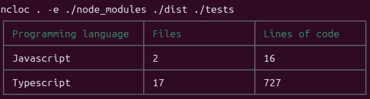

# NCloc

A cli written in Node.js inspired by [cloc](https://github.com/AlDanial/cloc) to count the lines of source code.

## Requirements
- Node.js version >= 20
  
## Installation

```
npm i -g ncloc
```

## Basic example


## Excluding directories



## Flags

```
ncloc <input>

Positionals:
  input  Directory/file path to count lines in

Flags:
  -e, --exclude  Directories/files paths to be excluded from counting
      --help     Show help
```

## Supported languages

To show all supported languages use the subcommand `languages`


